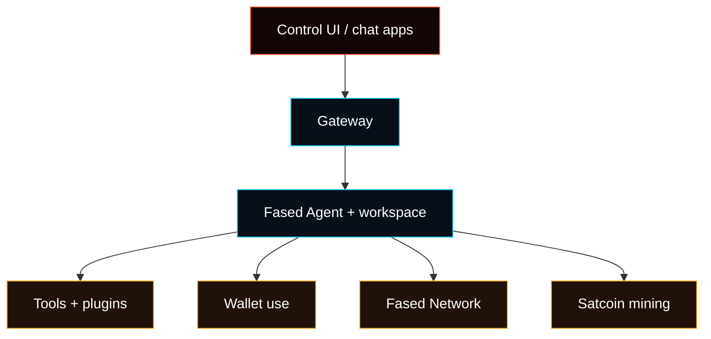

# Fased Agent Setup

Fased Agent is the agent workbench you run through one of two setup profiles:

- **Local** for your own computer. Use Terminal on macOS, WSL2 Ubuntu on
  Windows, or your Linux distro terminal.
- **VPS Hosting** for an always-on server. Ubuntu LTS is the recommended first
  VPS target.

Start with the Gateway and browser dashboard, then add models, skills, services,
chat apps, tasks, wallets, Fased Network, or Satcoin mining only when they have
a specific job.

Use this page after first boot to turn a working install into a real Agent
setup.

<Tabs>
  <Tab title="Local install">
    Run in macOS Terminal, Linux, or Ubuntu WSL2. Do not run it in Windows
    PowerShell or native Windows Node.js.

    ```bash
    curl -fsSL https://raw.githubusercontent.com/fased-ai/fased/main/install.sh \
      | bash -s -- --local
    ```

  </Tab>
  <Tab title="VPS Hosting install">
    SSH to the VPS as root, then run this inside that VPS shell:

    ```bash
    curl -fsSL https://raw.githubusercontent.com/fased-ai/fased/main/install.sh \
      | bash -s -- --hosting
    ```

    The streamed bootstrap verifies the immutable tagged Hosting payload before
    persistent Fased setup, then creates the separated operator, Gateway, and
    signer runtime identities. Continue with the [VPS Hosting
    guide](/install/vps) for its private-access check and recovery boundary.

  </Tab>
</Tabs>

<Columns>
  <Card title="Getting Started" href="/start/getting-started" icon="rocket">
    Choose Local or VPS Hosting, onboard the machine, and open the dashboard.
  </Card>
  <Card title="Control UI Setup" href="/start/control-ui-setup" icon="layout-dashboard">
    See what belongs in onboarding, Agent setup, Services, Tasks, and Advanced Config.
  </Card>
  <Card title="Fased Glossary" href="/start/operator-glossary" icon="book-open">
    Learn the shared wallet, mining, bond, and network terms.
  </Card>
</Columns>

## Agent Model



The recommended order is:

1. make the install stable
2. connect one trusted model
3. send the first browser chat
4. add skills, services, memory, chat apps, and tasks
5. add wallets, Fased Network, or Satcoin mining only when the base agent is ready

## Conservative Defaults

Start conservative:

- keep the Gateway private by default
- use Tailscale for hosted/admin access
- connect one trusted chat app before adding public routes
- keep wallet and mining workflows separate from normal chat
- review skills and services before allowing them for an Agent

For host hardening and gateway operations, use [Gateway & Ops](/gateway).

## First Operator Pass

After onboarding:

```bash
fased dashboard
fased status
```

Then work from the selected Agent:

| Surface            | Use it for                                                          |
| ------------------ | ------------------------------------------------------------------- |
| `Agent > Models`   | Provider auth, primary model, fallback model, task model            |
| `Agent > Skills`   | Create, install, configure, review, and allow Agent skills          |
| `Agent > Services` | Web/search, Gmail, Calendar, GitHub, browser/media, and custom APIs |
| `Agent > Channels` | Chat app setup and routing to this Agent                            |
| `Agent > Memory`   | Saved session context and archive state                             |
| `Agent > Tasks`    | Saved tasks, triggers, workflows, graphs, programs, and templates   |

Dashboard is the launch/status board. Use `/agents` for real setup.

## Workspace And Memory

The default workspace is:

```text
~/.fased/workspace
```

Fased creates starter files such as `AGENTS.md`, `SOUL.md`, `TOOLS.md`,
`IDENTITY.md`, `USER.md`, `HEARTBEAT.md`, `MEMORY.md`, and `memory/` when the
workspace is new. Treat this folder like the agent's private working context
and keep it private.

Useful links:

- [Agent workspace](/concepts/agent-workspace)
- [Memory](/concepts/memory)
- [Control UI Setup Model](/start/control-ui-setup)

## Wallet, Network, And Satcoin

Fased works without wallets or Satcoin. Add wallets, Fased Network, or Satcoin
modules only when they have a specific job:

| Path           | When to use it                                                                                           |
| -------------- | -------------------------------------------------------------------------------------------------------- |
| Wallet use     | When the Agent needs wallet roles, reviewed sends, balances, payment history, or wallet-connected skills |
| Fased Network  | When the Agent needs a public handle, services, or trust                                                 |
| Satcoin mining | When the Agent will mine, claim, and build mining history                                                |
| Bond           | When held SAT should support a stronger trust role                                                       |

Relevant pages:

- [Wallet](/plugins/crypto/wallet-page)
- [Fased Network](/start/federation)
- [Mining](/plugins/crypto/mining-page)
- [Advanced SAT mining](/plugins/crypto/mining-advanced)
- [Bond overview](/start/bond-operator-economy)

## Chat Apps And Tasks

Connect chat apps only after the browser chat works. Route each account, topic,
or guild to a selected Agent from `Agent > Channels`.

Use `Agent > Tasks` for saved work definitions. Activity history helps you
understand what happened; the owning domain page still controls the operation:

- Mining setup stays in Mining
- Wallet signing stays in Wallet
- Marketplace orders stay in Marketplace
- Chat app routing stays in Channels
- Service auth stays in Services

## Operations Checks

```bash
fased status
fased status --all
fased status --deep
fased health --json
```

Logs live under `/tmp/fased/` by default.

## Next Steps

<Columns>
  <Card title="Setup Matrix" href="/start/setup-matrix" icon="split">
    Choose Local or VPS Hosting and understand setup ownership.
  </Card>
  <Card title="Gateway runbook" href="/gateway" icon="server">
    Operate the Gateway, auth, logs, health checks, and remote access.
  </Card>
  <Card title="Tasks" href="/automation/cron-jobs" icon="calendar-clock">
    Schedule recurring Agent work and understand run history.
  </Card>
  <Card title="Security" href="/gateway/security" icon="shield">
    Review tokens, allowlists, sandboxing, and host boundaries.
  </Card>
</Columns>
