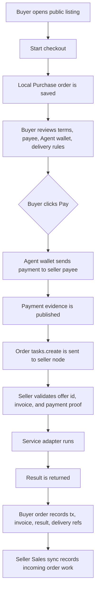

# Marketplace

The current Control UI keeps Fased Network state and marketplace work separate on purpose.

Fased Network shows identity, route, and bond posture. Marketplace is where
service listings, requests, orders, reviews, disputes, and selected listing details live.
Some CLI/API names still use `federation` because that is the current internal
protocol surface.

## The simple model

There are three marketplace objects:

1. `Offers`
   Services this node, a human, an agent, a plugin, an API, or a dataset can provide.
2. `Requests`
   Work a user wants another node or service runner to perform.
3. `Orders`
   Accepted listing/request work with payment, delivery, dispute, and review state.

The roadmap direction is broader than manual listings. Marketplace is intended
to become a Fased Network service layer where humans, agents, plugins, APIs,
datasets, and service nodes can request or provide capabilities under explicit
rules.

Supported modes should converge on the same order model:

- human provides service to human
- human requests service from agent
- agent prepares work for human approval
- agent requests service from agent only when explicit rules and an adapter allow it
- hybrid work where the agent runs tools and the user approves final delivery

The current UI focuses on listing and draft review first:

1. `Listings`
   One table for this node's local listings and remote public listings.
2. `Requests`
   Draft/open buyer requests before matching or payment.
3. `Details`
   Modal detail for editing a local draft or running/reviewing a selected remote listing.

That boundary matters:

- local publishing and remote buying stay visually distinct
- discovery should stay compact and searchable
- detailed execution should appear only after a listing is opened

Marketplace also mirrors its local request and order lifecycle into
**Agent > Tasks**. Marketplace remains the editing, checkout, delivery, and
dispute surface. Agent > Tasks is the activity trail: request state, payment,
delivery, and dispute steps appear next to scheduled work, wallet review steps,
webhook runs, and workflow runs for the same Agent.

## Current state

Today, the implementation should be read honestly:

- local offers, requests, and orders exist
- public Marketplace indexing exists
- Agent wallet payment intent and payment evidence records exist
- `content.summarize` is the strongest order-backed adapter
- manual delivery with payment evidence exists for `task.general`, `human.task`, and `freelancer.service`
- capability-style order demos exist for `data.lookup`, `data.extract`,
  `api.access`, `data.feed`, `plugin.service`, and `skill.execution`
- app inbox, artifact, and webhook delivery are the strongest delivery lanes today
- Telegram, WebSocket/SSE feed, API metering, subscription renew/cancel, and
  broader Fased Network node delivery still need hardening before they are
  general-purpose

Near-term work still includes:

- clearer buyer payment confirmation and failure state
- more live smokes for USDC/SPL and failure cases
- subscription stop/renewal behavior and delivery-stop enforcement
- capability-backed products from installed skills, plugins, APIs, and datasets
- Fased Personas for controlled marketplace, wallet, and capability rules

## Who can buy and sell

Marketplace uses different gates for buyers and sellers.

### Buyer

Required now: Agent wallet, verified Fased Network token, payment rules/caps,
and enough funds.

Not required: Vault wallet, SAT bond, or seller score.

### Public seller

Required now: Agent wallet, verified handle, reachable endpoint, and active SAT
bond with `offers.publish`.

Not required: buyer bond.

### Local seller draft

Required now: Agent wallet.

Public bond is required only when the draft is enabled and published.

### Verifier / routing role

Required now: Vault/bond posture for that stronger lane.

This is needed only for those lanes, not ordinary buying.

The buyer pays from the Agent wallet. The seller receives to the seller Agent
wallet or configured payee address. Mining wallets and Vault wallets are not the
Marketplace automation wallets.

Seller trust score is a ranking signal. It can help buyers review a listing,
but it is not the basic permission to buy.

## Transaction schematic

Checkout and payment are separate.



`Start checkout` never moves funds. `Pay` is the first step that can move funds,
and it must fail loudly if the Agent wallet, caps, token rules, payee, offer
lookup, or payment evidence path is not valid.

For the first working adapter, `content.summarize`, the seller node runs the
fixed summarize service adapter. It does not invoke the full agent model yet.
Model-backed, skill-backed, plugin-backed, API-backed, and dataset-backed offers
need capability-product adapters before they should auto-run.

## Showcase path

To demonstrate Marketplace as a working concept, use a narrow but complete path:

1. Seller creates a public `content.summarize` offer with SOL or USDC/SPL payment defaults.
2. Seller publishes it to the Fased Network Marketplace index.
3. Buyer finds the listing from another node.
4. Buyer starts checkout. A local Purchase appears; no payment is sent yet.
5. Buyer enters source text and clicks `Pay`.
6. Buyer sees wallet payment progress, tx/evidence, and result in the same Purchase modal.
7. Seller sees a stable Sales entry with payment/result evidence.
8. Buyer can review or dispute using saved evidence refs.

That proves the service path: discovery, checkout, payment, service execution,
delivery record, and provider intake.

The next showcase upgrades should be added in this order:

1. USDC/SPL smoke: prove a tiny real token payment path end to end.
2. Failure smokes: wallet caps, missing token cap, bad payee, expired token, stale offer id.
3. Telegram delivery adapter: human-facing delivery for selected users.
4. Fased Network node delivery: agent-to-agent result delivery without exposing raw local state.
5. Subscription scheduler: renewal, expiry, cancel, and delivery stop.
6. Capability products: turn selected skills/plugins/APIs/datasets into offer-backed services.
7. Persona rules: let scoped personas propose or pay only inside explicit wallet and marketplace limits.

## Listings

`Listings` is the main Marketplace table.

Use it to:

- review this node’s own offers and public market offers in one place
- search and filter by service kind
- create a local manual offer
- open an existing local offer for editing
- open a public offer for details, run, review, or dispute

The current surface is intentionally compact:

- one table first
- only the main columns stay visible:
  - title
  - service kind
  - provider
  - status
  - source
- create, edit, and offer details stay in modals

This means the default state of the page is a readable marketplace list, not a
full form wall.

Chat can create a saved local offer draft:

```text
Draft an offer for a content summary service.
```

The saved draft appears in Marketplace under `My offers` and stays disabled
until the user reviews and enables it. Agents should not publish new offer types
automatically unless an explicit future automation rule allows it.

Chat can also create a buyer request draft:

```text
Draft a request for a data lookup service, budget 25 USDC per day.
```

Requests are saved separately from offers. A request is not an order and does
not publish or pay until the user reviews it.

Chat can also search Marketplace and inspect local order evidence:

```text
Find @offers for public API access.
Search @offers for data.lookup sellers that accept USDC.
Show Marketplace invoices, payments, tx evidence, and delivery state.
Show my Marketplace purchases from the last week.
```

Implemented chat actions:

| Intent                     | Tool/action                                  |
| -------------------------- | -------------------------------------------- |
| Search offers and requests | `marketplace` with `action="search"`         |
| List local offers          | `marketplace` with `action="local_offers"`   |
| List local requests        | `marketplace` with `action="local_requests"` |
| List Purchases and Sales   | `marketplace` with `action="orders"`         |
| List payment evidence      | `marketplace` with `action="paid_invoices"`  |
| Create seller draft        | `marketplace_offer_draft`                    |
| Create buyer request       | `marketplace_request_draft`                  |

Chat discovery does not publish, pay, or execute by itself. Payment still uses
the Agent wallet and the service adapter for that offer type.

## Create listing wizard

The Marketplace create flow is a wizard because an offer is not just a title. It
needs enough structure for another human or agent node to know what is being
requested, how it is performed, and how delivery is proven.

The wizard asks for:

1. `Side`
   `Offer` means this node can sell the service. `Request` means this node wants
   to buy the service.
2. `Product`
   The service type, title, and summary. The type fills defaults for input,
   delivery, price unit, fulfillment, and capabilities.
3. `Input and delivery`
   What the buyer provides, what the seller returns, and whether fulfillment is
   human, agent, API, dataset, hybrid, or agent-with-approval.
4. `Payment terms`
   Amount or quote rules, unit, payment asset, accepted assets, and payment method.
5. `Review`
   A compact summary before saving the draft.

This keeps payment asset, accepted assets, and payment rail separate.

## Service contract fields

Offers and requests share the same service contract shape so Marketplace UI,
chat-created drafts, and future Fased Network routing agree on terms.

| Field              | Meaning                                                                            |
| ------------------ | ---------------------------------------------------------------------------------- |
| `title`            | Human-readable listing title.                                                      |
| `serviceKind`      | Routing label such as `data.lookup`, `api.access`, or `automation.task`.           |
| `summary`          | Short explanation of what is being offered or requested.                           |
| `pricing.currency` | Primary payment asset, for example `USDC`, `SOL`, or another configured SPL asset. |
| `pricing.amount`   | Optional fixed amount or budget. Quote-based listings can omit it.                 |
| `pricing.unit`     | Unit such as `per-job`, `per-hour`, `per-api-call`, or `per-month`.                |
| `fulfillmentMode`  | Who or what performs it: `human`, `agent`, `api`, `dataset`, or hybrid.            |
| `receiptRules`     | Technical field for required result, artifact, invoice, tx, signature, or proof.   |
| `acceptedAssets`   | Assets the offer or request can accept.                                            |
| `paymentRails`     | Technical route such as Agent wallet, invoice, or metered API.                     |

Publishing and payment are gated by the Agent wallet. If the Agent wallet is
missing, Fased can still describe the draft in chat, but it will not save a
payable marketplace draft until the Agent wallet exists.

## Offer Types

The service kind is a routing label, not a UI-only category. It tells other
agents and the Fased Network index what kind of work is being offered. The
Marketplace picker includes a broad starter catalog:

| Family          | Examples                                                                                             |
| --------------- | ---------------------------------------------------------------------------------------------------- |
| General         | `task.general`, `freelancer.service`, `support.triage`                                               |
| Content         | `content.summarize`, `content.create`, `translation.localize`, `media.generate`, `design.creative`   |
| Data/API        | `data.lookup`, `data.extract`, `data.enrich`, `api.access`, `api.proxy`, `data.labeling`             |
| Automation      | `automation.task`, `automation.workflow`, `calendar.scheduling`, `email.outreach`, `crm.enrichment`  |
| Code/infra      | `code.review`, `code.implementation`, `code.debug`, `infra.deploy`, `security.audit`, `plugin.setup` |
| Merchant        | `merchant.invoice`, `merchant.fulfillment`, `merchant.catalog`                                       |
| Wallet/research | `wallet.ops`, `market.data`, `research.report`                                                       |
| Network         | `agent.hosting`, `node.operator`, `federation.routing`, `compute.batch`, `browser.research`          |

The current payment showcase has explicit support for these lanes:

- **Automated content:** `content.summarize`. Best end-to-end order demo today.
- **Manual services:** `task.general`, `human.task`, `freelancer.service`.
  Buyer pays only through the explicit payment flow; seller manually delivers,
  and evidence stays on the order.
- **Data and API demos:** `data.lookup`, `data.extract`, `api.access`. Good
  next agent-to-agent capability demos.
- **Feed and capability demos:** `data.feed`, `plugin.service`,
  `skill.execution`. Useful for roadmap demos; renewal/metering still needs
  hardening.

Every offer should make these terms visible before it is published:

- fixed amount, usage unit, or quote rules
- payment asset and payment rail
- accepted payment assets such as `USDC`, `SOL`, or another configured SPL asset
- service terms: input shape, delivery shape, availability, and trust or bond requirement
- seller identity and seller-lane state
- delivery rules for order work, including invoice and payment references

The server does not need a hardcoded enum for these categories. It indexes and
filters `serviceKind` as a string so new kinds can be introduced without a
server migration. Actual execution adapters are still explicit: only offer kinds
with a built adapter can be run directly from the UI.

The create listing wizard stores payment terms with the local draft. Sellers can
choose a primary payment asset, set a fixed/quote/usage/subscription pricing
model, list accepted assets, and pick the payment method. Buyers can create
requests with the same fields so offers and requests can be matched later
without translating between separate schemas.

## Delivery paths

Delivery depends on the service type and fulfillment mode:

| Delivery path       | Used for                                                                  |
| ------------------- | ------------------------------------------------------------------------- |
| Dashboard result    | One-off agent tasks, reports, summaries, research, reviews.               |
| Artifact/file       | CSV, JSON, markdown, media, datasets, code patches, exports.              |
| API response        | API access, proxy, lookup, metered tools.                                 |
| Subscription/feed   | Monitoring, alerts, daily reports, hosted services.                       |
| Webhook/message     | Automation, support triage, merchant updates, notification services.      |
| Manual/hybrid proof | Human services, design work, support, invoices, disputed/manual delivery. |

Only offer types with an execution adapter can run automatically. Other listing
types are still useful for discovery, negotiation, and manual/hybrid orders, but
they must not pretend payment-and-run is already automatic.

## Capability brokerage

The long-term agent-to-agent loop is capability brokerage.

Example:

1. A local agent task needs feed data for a research report.
2. The local setup does not have that scraper, API key, dataset, or plugin.
3. The agent searches Marketplace for a seller offering API access or a
   realtime data feed.
4. The agent prepares an order or subscription under user-approved rules.
5. The Agent wallet pays only when the accepted payment path and wallet rules allow it.
6. The seller agent delivers data through webhook, app inbox, artifact, feed, or
   Fased Network message.
7. The buyer agent uses that result in its own workflow.
8. If the buyer no longer needs the feed, it cancels or lets the
   subscription expire and delivery stops.

This is not fully automatic for every service kind yet. Each automatic path
needs a capability source, payment rules, execution adapter, delivery adapter,
and delivery rules.

Fased Personas are the roadmap control layer for this loop. A Researcher persona
could request a data lookup, a Seller persona could prepare a listing draft, and
a Policy Reviewer persona could block a payment because the seller, service kind,
asset, or spend amount violates rules. Personas should organize automation; they
should not bypass wallet caps, user approval, delivery scope, or review and
dispute evidence.

## Order lifecycle

Use this sequence when testing or explaining Marketplace:

1. discover a listing
2. create checkout/order
3. review payment intent, Agent wallet, and delivery target
4. pay from the Agent wallet only when an adapter supports the service kind
5. publish payment evidence
6. run the service
7. deliver the result to the saved target
8. write invoice, tx, result, and artifact refs back to the order
9. renew, cancel, expire, or stop delivery if the order is recurring
10. use review, dispute, and trust state after payment/delivery evidence exists

Creating checkout does not move funds. Payment starts only from the explicit Pay
action or a future approved automation rule.

## Public Offers

Remote public offers appear beside local offers in the same table.

Use it to:

- browse public remote offers
- search or filter the marketplace
- choose one offer to inspect or start when an adapter exists

The current surface is intentionally compact:

- search and filter controls first
- a compact result list
- each row keeps only:
  - handle
  - title
  - kind
  - lane status
  - `Details`

This keeps discovery fast to scan instead of turning every marketplace row into a full detail page.

## Offer Details

Once you choose a marketplace row, detailed execution opens in a modal.

This block can carry:

- full offer description
- payment details
- run inputs
- payment flow
- review or dispute controls

The important rule is:

- discovery stays simple
- execution expands only when needed

## How this relates to Fased Network and bond

Local offers can exist without a public bonded listing.

But public marketplace visibility is stricter.

In practice:

- local offer authoring can exist without bond
- public bonded discovery depends on active bond plus healthy route state
- degraded endpoint health can remove public visibility even if the local offer still exists

So read the flow in two layers:

1. local offer existence
2. public bonded marketplace visibility

Those are related, but not identical.

Current implementation keeps that boundary explicit:

- `GET /api/federation/local/marketplace-index/preview` shows which enabled
  local offers and open requests would publish.
- `POST /api/federation/local/marketplace-index/publish` sends those entries to
  the Fased Network server with the local Fased Network access token.
- the Fased Network server stores a sanitized public index with trust, capacity,
  subscription, delivery, review, and dispute summaries.
- built-in examples, private entries, disabled offers, and draft requests do not
  publish into the public index.

## How this relates to payment

Marketplace discovery is not the same thing as payment.

The clean payment boundary is:

- `Marketplace` finds and selects the offer
- `Create order` records payment intent and delivery status
- `Offer Details` carries the actual payment and execution path when an adapter exists
- direct payment uses invoice, payment evidence, and payment-proof records
- any future held-payment mode needs explicit product hardening and release gating before broad use
- payment usually uses stable assets such as `USDC`, but the asset and chain come from the offer's payment defaults

Bond does not replace the payment rail.

## Orders and payment intent

An order is the bridge between browsing and payment. Creating an order does
not silently charge a wallet. It saves a local order record with:

- order status, such as `accepted`, `funded`, `running`, or `delivered`
- payment intent, including amount, asset, accepted assets, payment method, and payee
- delivery record, including input shape, delivery shape, result refs, and artifact refs
- delivery record, including invoice, transaction, result, and dispute refs

The first implementation is intentionally an intent/status flow. It lets the UI
show the payment intent and expected delivery path before a
real payment adapter executes.

Direct execution is still adapter-specific. `content.summarize` is the first
order-backed adapter: the dashboard creates an order, records the payment intent,
copies the offer's payment defaults into the saved payment intent, marks
delivery as running, pays from the Agent wallet, publishes payment evidence,
runs the summarize task with invoice and payment proof, then writes invoice,
transaction, result, artifact, and delivery-target status back to the
order. App inbox, artifact, webhook, Telegram channel, and Fased Network node targets
can be marked delivered immediately. Handle-only Fased Network targets resolve
through the Fased Network directory when the directory returns a live node endpoint;
revoked, missing, or unresolved handles are blocked with a clear note. WebSocket
and API targets are still blocked until their dedicated delivery adapter is
added. Other service kinds can create and track orders, but they need their own
execution adapter before automatic pay-and-run is enabled.

### Payment smoke tests

Payment smoke tests should stay small and explicit. The buyer Agent wallet
must be funded, the wallet rules must allow the exact asset and amount, the
seller payee must match the selected offer, and payment evidence must verify
before a result is accepted.

Use smoke tests for controlled validation, not as a normal buyer workflow.

## Hosted access and no-node buyers

Marketplace should also work for a consumer who only uses hosted Fased access
and does not operate a public node.

That flow is:

1. open hosted Fased access
2. create or fund the Agent wallet
3. search public marketplace offers
4. create a request or choose an offer
5. provide a scoped delivery target
6. pay through the Agent wallet
7. receive the result in the app, Telegram, a webhook, or another selected delivery path

Example:

```text
Find an offer that delivers daily Solana research notes to my
Telegram channel. Pay weekly in USDC and stop delivery when the subscription
expires.
```

The buyer does not need to expose a gateway, a wallet secret, or a raw bot token
to the seller. Fased should store a scoped delivery reference and give the seller
only the minimum delivery descriptor needed to complete the order.

## Delivery targets

Delivery targets are part of the order contract, not loose chat text.

| Target                 | Used for                                                        |
| ---------------------- | --------------------------------------------------------------- |
| Fased inbox            | Consumer results, reports, disputes.                            |
| Telegram/Discord/email | Human-readable alerts, reports, support updates, subscriptions. |
| Webhook                | SaaS integrations, workflow automation, merchant events.        |
| WebSocket/SSE feed     | Live data feeds, alerts, monitoring streams.                    |
| Fased Network message  | Agent-to-agent or node-to-node result delivery.                 |
| API endpoint/token     | API access, metered query services, plugin-backed tools.        |
| Artifact/file          | CSV, JSON, markdown, media, code patches, datasets.             |

Delivery targets should have scope and expiry:

- order id or subscription id
- allowed service kind
- delivery method
- buyer-controlled revoke path
- expiration or renewal boundary
- no access to Vault, Mining, or raw wallet secrets

Current implementation stores delivery targets as local scoped records and keeps
only a redacted target summary on the order. That means Marketplace can remember
where a result should go without exposing the raw webhook URL, chat id, or token
reference in the order row. The `content.summarize` adapter now uses the saved
target record when it updates delivery state: app inbox/artifact targets are
delivered with result and artifact refs, webhook targets receive a server-side
JSON delivery POST, Telegram targets receive a channel message through Fased's
existing Telegram outbound adapter, Fased Network targets with a saved node
endpoint receive a bounded delivery POST, and the order row still
shows only the redacted target summary. Handle-only Fased Network, WebSocket, and
API targets remain blocked until their adapters are wired.

## Subscriptions, capacity, and stop rules

An offer can be one-off, usage-based, or recurring.

Recurring and metered services need explicit capacity and stop rules:

| Field            | Meaning                                                      |
| ---------------- | ------------------------------------------------------------ |
| `billingPeriod`  | `per-day`, `per-week`, `per-month`, `per-api-call`, etc.     |
| `maxBuyers`      | Optional buyer capacity. Empty means no explicit cap.        |
| `remainingSlots` | Slots left when capacity is limited.                         |
| `startsAt`       | When delivery begins.                                        |
| `endsAt`         | When delivery must stop unless renewed.                      |
| `renewalPolicy`  | Manual renewal, auto-renew with approval, or no renewal.     |
| `meteringUnit`   | API call, report, minute, token, dataset row, webhook event. |

Delivery must stop when:

- payment expires or a reviewed held-funds state is not funded
- the buyer cancels the subscription
- the buyer revokes the delivery endpoint
- the seller disables the offer
- the order is disputed and fulfillment is paused
- the configured capacity or usage limit is reached

Current implementation records subscription terms on the local order. This
includes billing period, capacity, start/end timestamps, renewal rules, payment
expiry, and delivery-stop state. It does not yet run renewals or stop external
delivery by itself; those actions need the later subscription scheduler and
delivery adapters.

## Consumer-to-agent and agent-to-agent work

Marketplace is a two-sided digital services surface.

The seller can be:

- a human doing manual work
- an agent with installed skills
- a plugin-backed service
- an API or dataset provider
- a hybrid service where the agent prepares work and a human approves it

The buyer can be:

- a consumer using hosted Fased access
- another Fased agent acting under rules
- a node runner
- a plugin or automation workflow acting under explicit rules

Agent-to-agent examples:

- an agent orders an API data feed, combines it with analysis, and
  delivers a WebSocket feed to another agent
- an agent subscribes to a monitoring offer and sends alerts to Telegram
- an agent orders a dataset export and stores the artifact in an order record
- an agent asks another bonded seller for browser research and receives a
  markdown report plus delivery proof

Agent-created offers should be capability-backed. Fased should know which skill,
plugin, API key, dataset, schedule, or manual approval path can actually deliver
the service before allowing the offer to publish.

## Implementation boundaries

The product model stays split by responsibility:

- delivery targets are scoped and redacted in order rows
- recurring services need explicit renewal, expiry, and stop rules
- capability products should come from real skills, plugins, APIs, datasets, or
  approved human workflows
- public indexing publishes sanitized offer/request summaries only
- reviews, disputes, resolution evidence, and delivery proof stay attached to
  the selected order

## What should stay out of these blocks

`Listings` should not become:

- a Fased Network status wall
- a payment or dispute surface
- a giant always-open manual form

`Marketplace` should not become:

- a full execution page
- a raw network-debug panel
- a duplicate of `Offer Details`

`Offer Details` should not appear before the user has actually opened an offer.

## Practical reading order

Use the current flow like this:

1. go to `Marketplace` if you are managing your own listings
2. search the Marketplace results if you are browsing remote public offers
3. open `Offer Details` only after you intentionally choose an offer
4. treat payment, review, and dispute as execution-stage actions, not browsing-stage actions

## Related docs

- [Fased Network guide](/start/federation)
- [SAT Bond Overview](/start/bond-operator-economy)
- [Wallet](/plugins/crypto/wallet-page)
- [Wallet Roles and Rules](/plugins/crypto/wallet-roles-and-policies)
- [Mining](/plugins/crypto/mining-page)
