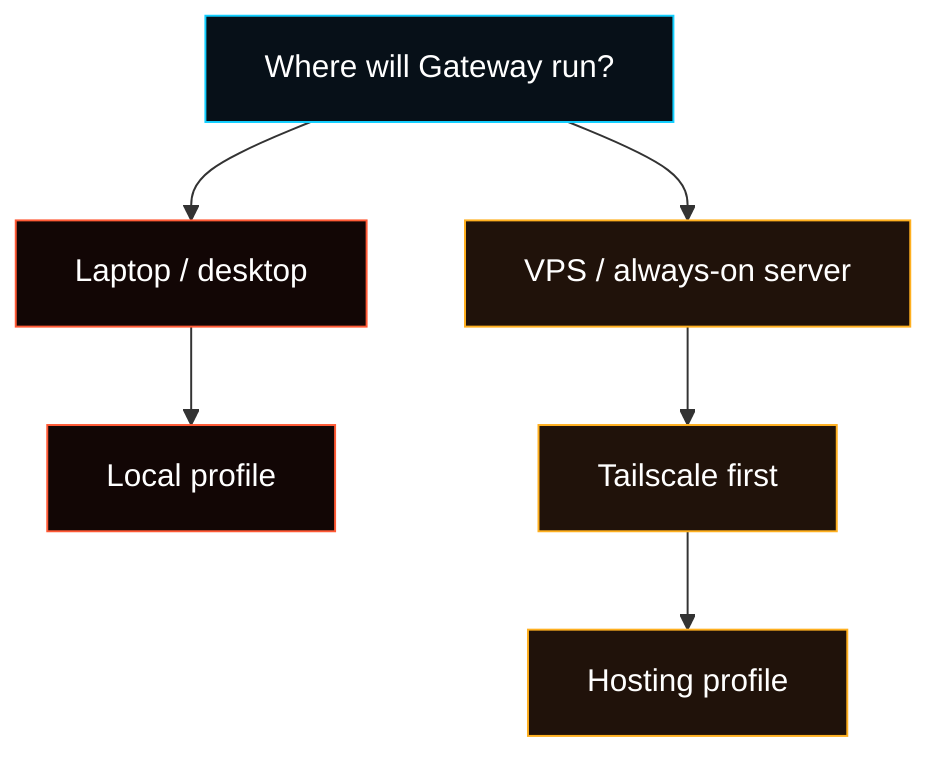

# First-run Setup Matrix

Use this page before `install.sh` or `fased onboard`.

The main choice is where the **Gateway** runs. The Gateway is the process that
the Control UI, CLI, channels, skills, wallets, and future Agents talk to.

## Choose The Right Host Setup Profile



### Local

Use this when the agent runs on your own computer. On macOS, use Terminal. On
Windows, use WSL2 with Ubuntu. On Linux, use your distro terminal.

It creates local config, workspace, gateway settings, local signer/wallet state
if selected, and local service startup. Tailscale is not part of the basic Local
path.

Risk: Local on a VPS means no SSH/firewall hardening. It can still run, but it
does not apply the hosting security baseline.

### Hosting

Use this when the agent runs on a VPS or always-on server.

Ubuntu LTS is the recommended first VPS target. Debian is close to the same
path. Fedora/RHEL-family and other Linux VPS systems can work, but use the
matching package-manager notes from [Install](/install) when a minimal image is
missing basic tools.

It uses the local runtime setup plus hosting hardening: Tailscale-first admin
access, firewall policy, SSH hardening, fail2ban/unattended-upgrades where
supported, and hosted gateway service behavior. Tailscale is required.

Risk: Hosting on personal Linux changes SSH/firewall behavior. Use it only when
you intentionally want server-style hardening on that machine.

<Warning>
If you are SSH'd into a VPS and choose **Local**, Fased will not protect that
host like a hosted node. If you choose **Hosting** on your personal Linux
workstation, the wizard may change firewall and SSH behavior for that machine.
</Warning>

<Note>
For the normal Hosting path you usually do not need a Tailscale API key. Create
or sign into a Tailscale account, join the host to your tailnet with the
`tailscale` CLI, then run Fased onboarding. Tailscale API/auth keys are only for
automated provisioning. See [Tailscale](/gateway/tailscale) and the VPS install
guides for the detailed host steps.
</Note>

<Tip>
Simple VPS order: create Ubuntu LTS server, install/sign into Tailscale on the
VPS, run the hosted Fased installer, then test Tailscale SSH from your own
computer. If the wizard offers a Tailscale auth key, use it only for scripted
provisioning. For normal setup, use browser login: the Tailscale CLI shows a
login URL in SSH; open that URL in your local computer's browser, then return to
the SSH session. Before SSH/firewall lock-down, the wizard asks you to test
`ssh app@YOUR_VPS_TAILSCALE_NAME` from your own computer and only continue after
that terminal reaches `/home/app/fased`.
</Tip>

## Actual Interactive Wizard Order

The current CLI wizard order is:

1. Choose QuickStart or Manual.
2. Read the setup map, then choose Local or Hosting profile.
3. If config already exists, choose update settings or repair auth/sessions.
4. Choose workspace directory.
5. Configure Gateway port, bind address, and auth.
6. Configure Fased Network / federation when selected.
7. Build or configure native signer support, then configure wallet roles and the optional singleton Mining wallet.
8. Write config and bootstrap workspace/session state.
9. Apply hosting security only when the Hosting profile is selected. Hosting requires Tailscale.
10. Run final daemon, health, Control UI, and readiness steps.

`install.sh` installs dependencies, builds the runtime, installs the CLI, and
then runs the onboarding wizard with daemon setup unless you pass `--no-onboard`.

## What Each Step Is For

- **Model:** needed before the agent can answer. Add it after onboarding in
  `Agent > Models`, then use it in Chat or tasks.
- **Provider auth:** stores API/OAuth credentials or references for model
  providers. Ordinary setup belongs in `Agent > Models`.
- **Gateway:** the connection point for Control UI, CLI, WebChat, channels, and
  remote clients.
- **Tailscale:** hidden from the basic Local path. Required for Hosting profile
  admin access.
- **Channels:** external apps like Telegram, Discord, WhatsApp, and Slack.
  Connect them after onboarding in `Agent > Channels`, then route each account
  to an Agent.
- **Wallet:** policy-bound actions for sends, receipts, mining, Marketplace,
  and reviewed wallet-connected workflows. Not required for normal chat.
- **Skills:** agent abilities. Configure, edit, install, and allow them after
  onboarding in `Agent > Skills`.
- **Plugins:** runtime extensions. Install/review after onboarding in
  Control UI > Extensions.
- **Hooks:** background automation that runs around agent events. Enable
  `session-memory` after onboarding in `Agent > Memory`.
- **Memory:** workspace memory files, session archives, and optional QMD-backed
  indexing/export. Memory diagnostics are read-only in the UI; repair remains
  in Debug/CLI.

## Onboarding vs Control UI vs CLI

### First working model

- Onboarding: not normal onboarding.
- Control UI: `Agent > Models` adds provider auth when needed and saves the
  Agent's primary, fallback, and task model refs.
- CLI: `fased configure`, provider/auth commands, and env/profile files.

### Gateway access

- Onboarding: choose port, bind, auth, token/password, and Hosting Tailscale.
- Control UI: Dashboard shows compact Gateway access; Debug owns raw
  diagnostics.
- CLI: `fased dashboard`, `fased status`, `fased doctor`.

### Channels

- Onboarding: optional setup prompt.
- Control UI: `Agent > Channels` lists setup/status/start-stop/probe controls
  and assigns routes to Agents. Channels do not own Tasks.
- CLI: channel-specific config commands.

### Services

- Onboarding: not normal onboarding.
- Control UI: `Agent > Services` owns connector setup/status for web/search,
  Gmail/Calendar, GitHub, browser/media, plugin-reported APIs, and task
  needs-access recovery.
- CLI: service-specific CLI/config commands.

### Wallet / Mining / Network

- Onboarding: optional setup, role assignment, and readiness summary.
- Control UI: Wallet, Mining, and Fased Network stay separate source-of-truth
  pages. `/agents` may show their setup status but should load the same live
  data.
- CLI: wallet, mining, and federation commands.

### Skills

- Onboarding: not normal onboarding.
- Control UI: `Agent > Skills` separates bundled, ready, needs API key, needs
  dependency, needs config, disabled, and blocked. It stores the selected
  Agent's skill access policy.
- CLI: `fased skills` plus config/env setup.

### Plugins

- Onboarding: not normal onboarding.
- Control UI: Extensions/Plugins owns source trust, plugin-catalog activation,
  dependency/script warnings, scanners, and update review.
- CLI: `fased plugins`.

### Hooks

- Onboarding: not normal onboarding.
- Control UI: Extensions owns hook pack lifecycle. Agent memory archive control
  lives in `Agent > Memory`; external webhook task triggers should move to
  Tasks later.
- CLI: `fased hooks`.

### Memory

- Onboarding: not normal onboarding.
- Control UI: Memory page is read-only diagnostics and QMD overview.
  `Agent > Memory` owns session-memory activation and mirrors QMD setup.
- CLI: `fased memory` and Debug repair flows.

### Tasks

- Onboarding: not required for first chat.
- Control UI: Tasks are created from Chat, channels, Agent > Tasks, or task deep
  links. Runtime still uses cron internally, but UI should say Tasks.
- CLI: task/cron commands where available.

## Post-onboarding Control UI Shape

After onboarding, use `/agents` as the single **Agent Setup** checklist:

```text
Model connected
Provider auth ready
Memory archive on/off
Skills ready or needs setup
Channels connected
Wallet policy
Task bindings
```

Dashboard should stay a launch/control widget board. It should not duplicate the
full setup wizard. Debug keeps raw diagnostics, repair previews, provider
catalog dumps, plugin runtime warnings, and low-level RPC surfaces.

For page-by-page browser setup ownership, read
[Control UI Setup Model](/start/control-ui-setup).
