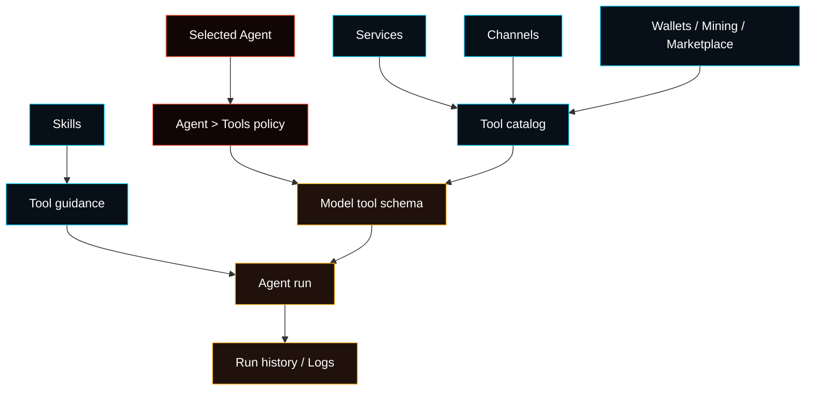

# Tools

Tools are typed capabilities a selected Agent may call. They are not raw plugin
config and they are not a second setup system.

Normal setup starts from **Agents**, select the Agent, then open **Agent >
Tools**. That page decides which discovered tools this Agent may use. Credentials
and domain controls stay on the owning surfaces.



## Setup Ownership

- Allow or deny tools for an Agent: **Agent > Tools**.
- Web/search, GitHub, Gmail, and media credentials: **Agent > Services**.
- Chat delivery and channel actions: **Agent > Channels**.
- Skill instructions and dependencies: **Agent > Skills**.
- Wallet approvals and signing: **Wallets**.
- Mining start/stop, capital, and claims: **Mining**.
- Marketplace offers and orders: **Marketplace**.
- Device pairing and diagnostics: **Advanced > Nodes**.

Agent > Tools should answer: “May this Agent use this capability?” It should
not collect API keys, wallet approvals, mining capital, channel credentials, or
plugin install settings.

## Tool Families

- Runtime and files: `exec`, `process`, `read`, `write`, `edit`,
  `apply_patch`. Start with [Exec](/tools/exec) and [Files](/tools/files).
- Web and browser: `web_search`, `web_fetch`, and `browser`. Start with
  [Web](/tools/web) and [Browser](/tools/browser).
- Messaging: `message`, polls, reactions, and threads. Start with
  [Channels](/channels).
- Sessions and Agents: `sessions_*`, `agents_list`, sub-agents, and ACP. Start
  with [Subagents](/tools/subagents).
- Tasks: scheduled task and run controls. Start with [Automation](/automation).
- Nodes and media: canvas, camera, screen, audio, location, and notifications.
  Start with [Nodes](/nodes).
- Review and output: `diff_view`, text-to-speech, reactions, and thinking
  levels. Start with [Diff Viewer](/tools/diff-viewer).
- Workflow helpers: LLM Task and task/workflow orchestration. Start with
  [LLM Task](/tools/llm-task) and [Tasks](/automation/cron-jobs).

## Tool Policy

Tool policy can be global or per-Agent.

```json5
{
  tools: {
    profile: "coding",
    deny: ["group:runtime"],
  },
  agents: {
    list: [
      {
        id: "support",
        tools: {
          profile: "messaging",
          allow: ["slack"],
        },
      },
    ],
  },
}
```

Profiles:

- `minimal`: only basic session status.
- `coding`: file, runtime, web, session, memory, and media tools.
- `messaging`: message and session tools.
- `full`: no profile restriction.

Groups:

- `group:runtime`: `exec`, `process`, `code_execution`.
- `group:fs`: `read`, `write`, `edit`, `apply_patch`.
- `group:sessions`: session list/history/send/spawn/yield/status and
  sub-agents.
- `group:memory`: memory search/read tools.
- `group:web`: `web_search`, `web_fetch`, `x_search`.
- `group:ui`: browser, canvas, diff view.
- `group:automation`: task/gateway automation controls.
- `group:messaging`: message tool.
- `group:nodes`: paired node tools.
- `group:agents`: agent list and plan update tools.
- `group:media`: image, music, video, and text-to-speech tools.
- `group:fased`: all built-in Fased tools except provider plugin tools.

Provider-specific policy can only narrow access:

```json5
{
  tools: {
    profile: "coding",
    byProvider: {
      anthropic: { profile: "minimal" },
    },
  },
}
```

## Boundaries

- A denied tool is not sent to the model provider.
- A skill teaches the Agent how to use tools; it does not grant tool access.
- A plugin may register tools; installing a plugin does not automatically grant
  every Agent access to those tools.
- Wallet, mining, marketplace, and node actions keep their own approval and
  policy gates.
- `apply_patch` is available only when enabled and allowed for compatible model
  paths.
- Host or node `exec` needs approvals unless the operator deliberately changes
  that policy.

## Start Here

<Columns>
  <Card title="Exec Tool" href="/tools/exec" icon="terminal">
    Shell execution, background processes, node execution, and approvals.
  </Card>
  <Card title="Web Tools" href="/tools/web" icon="search">
    Search and fetch setup through Agent Services.
  </Card>
  <Card title="Browser" href="/tools/browser" icon="globe">
    Managed browser profiles, snapshots, screenshots, and UI actions.
  </Card>
  <Card title="Skills" href="/tools/skills" icon="sparkles">
    Instructions, dependency checks, templates, and per-Agent skill access.
  </Card>
</Columns>
