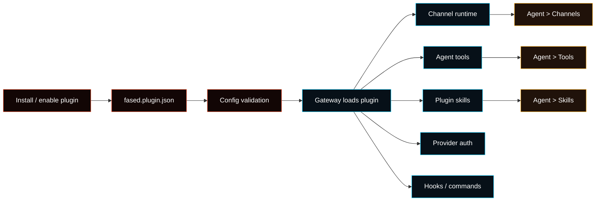

# Plugins

Plugins extend the Gateway with trusted code. They can add channel runtimes,
model-provider auth flows, Agent tools, slash commands, skills, hooks, and
Gateway RPC methods.

Use plugins when a feature needs runtime code that is not part of the core
Gateway. Use **Agent > Skills** when you only need instructions. Use **Agent >
Services** when you only need credentials for an existing service.



## Where Plugin Setup Lives

| Need                                      | Use                                             |
| ----------------------------------------- | ----------------------------------------------- |
| Install, enable, disable, update, inspect | **Extensions** or `fased plugins ...`           |
| Channel account setup                     | **Agent > Channels**                            |
| Agent tool allow/deny                     | **Agent > Tools**                               |
| Skill access and dependency setup         | **Agent > Skills**                              |
| Provider sign-in/API key                  | **Agent > Models**                              |
| Raw plugin config                         | **Advanced > Config** when no focused UI exists |

Plugins are runtime extensions. They do not automatically grant a selected Agent
permission to use every tool, skill, channel, or wallet-related path they expose.

## Install And Enable

List plugins:

```bash
fased plugins list
```

Install an external package:

```bash
fased plugins install @fased/voice-call
```

Install from a local checkout:

```bash
fased plugins install ./extensions/voice-call
```

Enable or disable:

```bash
fased plugins enable voice-call
fased plugins disable voice-call
```

Restart the Gateway after changing runtime plugin state.

## What A Plugin Can Provide

| Capability      | Example                                    | User setup surface             |
| --------------- | ------------------------------------------ | ------------------------------ |
| Channel runtime | Zalo Personal, external chat adapters      | Agent > Channels               |
| Agent tool      | workflow helper, voice-call tool           | Agent > Tools                  |
| Skill pack      | plugin-owned `skills/<name>/SKILL.md`      | Agent > Skills                 |
| Provider auth   | OAuth or token setup for a model provider  | Agent > Models                 |
| Gateway method  | `pluginId.status`, `pluginId.action`       | Plugin-specific docs / CLI     |
| Slash command   | `/plugin-command ...` without a model turn | Chat/channel command surface   |
| Hook            | lifecycle/event hook registered by plugin  | Plugin lifecycle, not Hooks UI |

Channel plugins put account config under `channels.<id>`, not
`plugins.entries.<id>.config`, because Channels owns account setup and routing.

Agent tools registered by plugins still require Agent tool policy. Skills
shipped by plugins still require Agent skill access. Wallet, mining,
marketplace, and node actions keep their own approval gates.

## Manifest Requirement

Every plugin must ship `fased.plugin.json` in the plugin root. The manifest lets
Fased validate plugin config without executing plugin code.

Minimal manifest:

```json
{
  "id": "my-plugin",
  "configSchema": {
    "type": "object",
    "additionalProperties": false,
    "properties": {}
  }
}
```

Read the full reference in [Plugin manifest](/plugins/manifest).

## Built-In Examples

<Columns>
  <Card title="OpenProse" href="/plugins/open-prose" icon="file-text">
    Markdown-first workflow programs and an optional skill pack.
  </Card>
  <Card title="Voice Call" href="/plugins/voice-call" icon="phone">
    Outbound and inbound call workflows through a trusted plugin.
  </Card>
  <Card title="Zalo Personal" href="/plugins/zalouser" icon="message-circle">
    Personal Zalo channel runtime backed by the bundled extension.
  </Card>
  <Card title="Community Plugins" href="/plugins/community" icon="package">
    Listing requirements and third-party plugin quality bar.
  </Card>
</Columns>

## Safety

Plugins run in the Gateway process. Treat them as trusted code.

- Install plugins only from sources you trust.
- Prefer `plugins.allow` allowlists for non-bundled plugins.
- Keep plugin dependency installs pinned and reviewed.
- Do not use a plugin to bypass Agent tool policy, wallet approvals, mining
  controls, marketplace authority, or channel access policy.
- Missing or invalid manifests should block config validation.

## Developer References

- [Plugin manifest](/plugins/manifest)
- [Plugin Agent Tools](/plugins/agent-tools)
- [Skills](/tools/skills)
- [Tools](/tools)
- [Channels](/channels)
