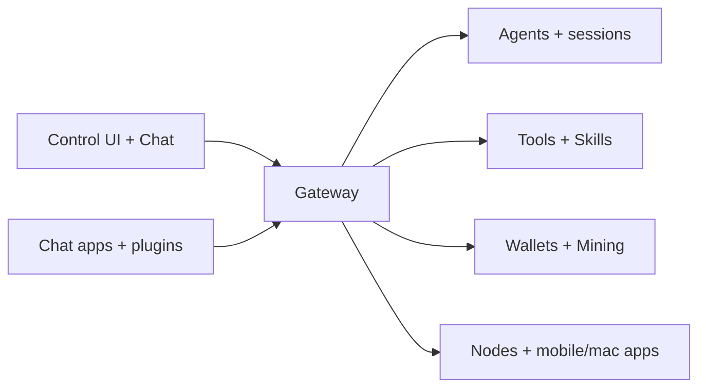

---
read_when:
  - 向新用户介绍 Fased
summary: Fased 是自托管个人智能体运行时，包含 Gateway、Control UI、Skills、多渠道路由，以及可选的钱包、SAT Mining 和 Fased Network 模块。
title: Fased
x-i18n:
  generated_at: "2026-02-04T17:53:40Z"
  model: claude-opus-4-5
  provider: pi
  source_hash: fc8babf7885ef91d526795051376d928599c4cf8aff75400138a0d7d9fa3b75f
  source_path: index.md
  workflow: 15
---

# Fased

<p align="center">
  <strong>自托管个人智能体运行时。</strong><br />
  在自己的机器或服务器上运行 Gateway，通过浏览器 Control UI 管理 Agent、模型、Skills、工具、消息渠道，以及可选的钱包、SAT Mining 和 Fased Network 模块。
</p>

<Columns>
  <Card title="入门指南" href="/start/getting-started" icon="rocket">
    安装 Fased 并在几分钟内启动 Gateway 网关。
  </Card>
  <Card title="运行向导" href="/start/wizard" icon="sparkles">
    通过 `fased onboard` 和配对流程进行引导式设置。
  </Card>
  <Card title="打开控制界面" href="/web/control-ui" icon="layout-dashboard">
    打开 Dashboard、Chat、Agents、Usage 和 Advanced；按需启用 Wallets、Mining 和 Network。
  </Card>
</Columns>

Fased 通过单个 Gateway 进程连接模型、工具、消息渠道、节点、钱包、任务和浏览器 Control UI。默认入口是浏览器，不需要先配置 Telegram 或 WhatsApp 才能聊天。

## 工作原理



Gateway 是会话、路由、工具访问、渠道连接和运行时状态的事实来源。

## 核心功能

<Columns>
  <Card title="Agent-first 工作台" icon="bot">
    在 Agents 页面为每个 Agent 管理 Models、Channels、Skills、Tools、Memory、Services、Tasks 和 Sessions。
  </Card>
  <Card title="浏览器 Control UI" icon="layout-dashboard">
    Dashboard、Chat、Wallets、Mining、Usage、Extensions、Notifications 和 Advanced 都在同一个本地 UI 中。
  </Card>
  <Card title="多渠道路由" icon="message-square">
    Telegram、Discord、WhatsApp、Slack、Signal 和扩展渠道都路由到选定 Agent。
  </Card>
  <Card title="Skills + 工具" icon="sparkles">
    创建、安装、审查和授权 Skills；再用 Agent > Tools 控制可用工具。
  </Card>
  <Card title="可选钱包与 SAT Mining" icon="shield">
    分离 Agent、Mining、Vault 钱包角色，并通过审批、caps 和 Skill Grants 控制资金访问。
  </Card>
  <Card title="移动节点" icon="smartphone">
    配对 iOS、Android、macOS 或无头节点；节点状态在 Advanced > Nodes 中查看。
  </Card>
</Columns>

## 快速开始

<Steps>
  <Step title="安装 Fased">
    ```bash
    git clone https://github.com/fased-ai/agent.git
    cd fased
    ./install.sh
    ```
  </Step>
  <Step title="新手引导并安装服务">
    ```bash
    fased onboard --install-daemon
    ```
  </Step>
  <Step title="打开 Control UI 并完成 Agent 设置">
    ```bash
    fased dashboard
    ```

    在浏览器中打开 **Agents**，为默认 Agent 配置 Models，然后到 **Chat** 发送第一条消息。消息渠道可以稍后在 **Agent > Channels** 添加。

  </Step>
</Steps>

需要完整的安装和开发环境设置？请参阅[快速开始](/start/quickstart)。

## Dashboard 和 Control UI

Gateway 网关启动后，打开浏览器控制界面。

- 本地默认地址：http://localhost:18789/
- 远程访问：[Web 界面](/web)和 [Tailscale](/gateway/tailscale)
- Dashboard 是概览小组件板；普通设置从 **Agents** 开始；Debug、Nodes 和原始配置在 **Advanced**。

## 配置（可选）

配置文件位于 `~/.fased/fased.json`。

- 普通用户优先使用 Control UI：**Agent > Models**、**Agent > Channels**、**Agent > Skills**、**Agent > Tools**、**Agent > Memory**。
- 原始配置保留在 **Advanced > Config**，用于高级或恢复场景。

如果你要手动限制渠道访问，可以从每个渠道账户的 allowlist/配对策略开始。普通渠道配置请先查看 **Agent > Channels**。

```json5
{
  channels: {
    whatsapp: {
      allowFrom: ["+15555550123"],
      groups: { "*": { requireMention: true } },
    },
  },
  messages: { groupChat: { mentionPatterns: ["@fased"] } },
}
```

## 从这里开始

<Columns>
  <Card title="文档中心" href="/start/hubs" icon="book-open">
    所有文档和指南，按用例分类。
  </Card>
  <Card title="配置" href="/gateway/configuration" icon="settings">
    原始 Gateway 配置参考；普通设置优先使用 Agents 和 Advanced。
  </Card>
  <Card title="远程访问" href="/gateway/remote" icon="globe">
    SSH 和 tailnet 访问模式。
  </Card>
  <Card title="渠道" href="/channels/telegram" icon="message-square">
    Telegram、Discord、WhatsApp 等渠道的具体设置。
  </Card>
  <Card title="节点" href="/nodes" icon="smartphone">
    iOS、Android、macOS 和无头节点；Control UI 中位于 Advanced > Nodes。
  </Card>
  <Card title="帮助" href="/help" icon="life-buoy">
    常见修复方法和故障排除入口。
  </Card>
</Columns>

## 了解更多

<Columns>
  <Card title="完整功能列表" href="/concepts/features" icon="list">
    全部渠道、路由和媒体功能。
  </Card>
  <Card title="多智能体路由" href="/concepts/multi-agent" icon="route">
    工作区隔离和按智能体的会话管理。
  </Card>
  <Card title="安全" href="/gateway/security" icon="shield">
    令牌、白名单和安全控制。
  </Card>
  <Card title="故障排除" href="/gateway/troubleshooting" icon="wrench">
    Gateway 网关诊断和常见错误。
  </Card>
  <Card title="关于与致谢" href="/reference/credits" icon="info">
    项目起源、贡献者和许可证。
  </Card>
</Columns>
