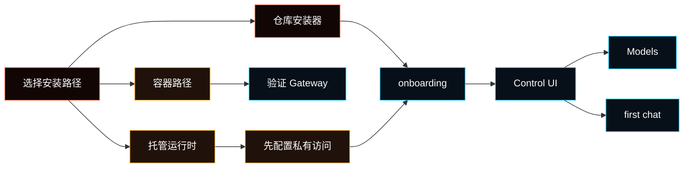

---
read_when:
  - 安装 Fased
  - 需要本地、容器或私有主机安装路径
summary: 使用仓库安装器安装 Fased，并在 Control UI 中完成后续设置。
title: 安装
x-i18n:
  generated_at: "2026-05-31T00:00:00Z"
  model: manual
  provider: codex
  source_path: install/index.md
---

# 安装

如果已经完成 [Getting Started](/start/getting-started)，通常可以继续从那里走。这个页面用于安装方式、平台说明、托管配置和维护入口。



## 系统要求

- [推荐 Node 24，或带 `node:sqlite` 的 Node 22.14+](/install/node)
- macOS、Linux，或通过 WSL2 运行的 Windows
- 只有从源码构建时才需要 `pnpm`

<Note>
Windows 上建议使用 [WSL2](https://learn.microsoft.com/en-us/windows/wsl/install)，并在 Ubuntu 里运行 Fased。
</Note>

## 推荐路径

使用 `fased-ai/fased` 的仓库安装器：

```bash
git clone https://github.com/fased-ai/fased.git fased
cd fased
./install.sh
```

安装器会：

- 检查主机环境
- 检查 Node，并在支持的 Linux 主机上安装缺失依赖
- 安装 `fased` CLI
- 默认运行 onboarding
- 引导你打开浏览器 Control UI

只安装 CLI/runtime、不运行 onboarding：

```bash
./install.sh --no-onboard
```

参数和自动化细节见 [Installer Reference](/install/installer)。

## Onboarding 做什么

Onboarding 创建基础运行时：state directory、config、workspace、Gateway
service、dashboard access，以及选定的托管姿态。

它不会配置每一个 Agent 能力。安装后，从选中 Agent 的 Control UI 继续：

1. **Models**
2. **Chat**
3. **Channels**
4. **Services**
5. **Skills / Tools**
6. **Memory**
7. **Tasks**
8. Wallets、Mining、Fased Network 只在你明确启用时再配置

<Note>
预发布安装保持 SAT runtime ids 为空。官方 Satcoin mainnet proof 发布后，
在 Mining 页面使用 **Sync** 验证签名 manifest，并写入 `config/sat-runtime.env`。
</Note>

## 托管运行时姿态

VPS 或托管运行时建议：

1. 使用干净的基础 OS 镜像
2. onboarding 前先加入 Tailscale
3. onboarding 时选择 hosting profile
4. 通过 Tailscale 或 SSH tunnel 保持私有管理访问
5. 不要把原始 Gateway 端口直接公开到互联网

具体命令见 [VPS hosting](/install/vps)、[Hetzner](/install/hetzner)
或 [GCP](/install/gcp)。

## 安装方式表

| 方式                    | 状态             | 适用场景                                        |
| ----------------------- | ---------------- | ----------------------------------------------- |
| 仓库安装器 `install.sh` | 推荐公开路径     | macOS、Linux、WSL2、本地笔记本或 VPS 运行时     |
| 源码 checkout           | 贡献者路径       | 需要构建、测试或直接修改仓库                    |
| 托管/VPS profile        | 支持             | 需要常驻 Linux 主机，并先设置私有访问           |
| Docker                  | 可选支持路径     | 容器化 Gateway 或 sandbox 验证                  |
| Podman                  | 支持的容器路径   | Linux 上的 rootless container                   |
| Nix                     | 高级/声明式路径  | 已经使用 Nix 或 Home Manager 管理运行时         |
| Bun                     | 实验性开发路径   | 本地 TypeScript 迭代；Gateway runtime 使用 Node |
| Remote client mode      | 支持的客户端模式 | 本机连接已有 Gateway                            |
| Task worker install     | 运行时安装后支持 | Gateway/runtime 已存在，需要单独的 task worker  |

<Note>
公开 npm/pnpm 全局安装还不是正常公开设置路径。发布包和文档准备好之前，请使用仓库安装器。
</Note>

## 验证安装

```bash
fased doctor
fased status
fased dashboard
```

结果应当是：

- `fased doctor` 没有阻塞性设置错误
- `fased status` 显示预期 Gateway target
- `fased dashboard` 打开带认证信息的 Control UI 链接

## 安装后顺序

新运行时建议按这个顺序：

1. 验证 runtime health
2. 确认 operator access 是私有的
3. 配置 model access
4. 发送第一条 chat
5. 按需要添加 channels 和 services
6. 使用钱包相关功能前先定义 wallet/signer posture
7. base runtime 稳定后再启用 Mining 或 Fased Network

安装成功只代表 runtime 存在；channels、services、wallets、mining、network
roles 仍需要各自的设置检查。

## `fased` not found

<Accordion title="PATH 诊断和修复">
快速诊断：

```bash
node -v
ls -l "$HOME/.local/bin/fased"
echo "$PATH"
```

仓库安装器会把 launcher 写到
`${FASED_CLI_BIN_DIR:-$HOME/.local/bin}/fased`。如果 `$HOME/.local/bin`
不在 PATH 中，shell 找不到 `fased`。

把它加入 `~/.zshrc` 或 `~/.bashrc`：

```bash
export PATH="$HOME/.local/bin:$PATH"
```

然后打开新终端，或在 zsh 中运行 `rehash` / bash 中运行 `hash -r`。
</Accordion>

## 更新、迁移、卸载

- [更新](/install/updating)
- [迁移](/install/migrating)
- [卸载](/install/uninstall)
