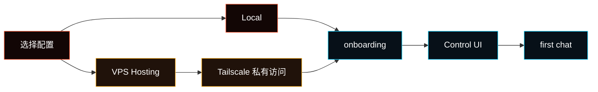

---
read_when:
  - 安装 Fased
  - 需要本地、容器或私有主机安装路径
summary: 选择 Local 或 VPS Hosting 安装 Fased，并在 Control UI 中完成设置。
title: 安装
x-i18n:
  generated_at: "2026-05-31T00:00:00Z"
  model: manual
  provider: codex
  source_path: install/index.md
---

# 安装

Fased 有两种受维护的设置配置：自己的电脑使用 **Local**，常驻 Linux
服务器使用 **VPS Hosting**。如果你已经完成 [Getting
Started](/start/getting-started)，通常可以继续从那里设置 Agent。



## 系统要求

- macOS、Linux，或通过 WSL2 Ubuntu 运行的 Windows
- 可以访问 Fased GitHub 仓库
- 如果自行管理 Node，请使用 Node 24，或带内置 `node:sqlite` 的 Node
  22.14+
- 只有源码/贡献者构建才需要自行管理 `pnpm`

<Warning>
Windows 运行时只支持 **WSL2 Ubuntu**。需要 Windows 11，或 Windows 10
版本 2004/build 19041 及以上版本。在管理员 PowerShell 中运行
`wsl --install -d Ubuntu`，按提示重启，然后运行 `wsl --update`、
`wsl --version` 和 `wsl --list --verbose`。WSL 必须为 0.67.6 或更新版本，
Ubuntu 必须显示版本 2。

随后打开 Ubuntu 应用，并只在 Ubuntu shell 中运行安装器、CLI、Gateway、
钱包和 signer。不要在 PowerShell、命令提示符、Git Bash、WSL1 或原生
Windows Node.js 中运行 Fased；native signer 使用 Unix socket。完整步骤见
[Windows (WSL2)](/platforms/windows)。
</Warning>

## Local 安装

Local 适用于 macOS Terminal、Linux 电脑和 WSL2 Ubuntu。Tailscale 可选，
安装器不会应用 VPS 的 SSH 或防火墙加固。

```bash
curl -fsSL https://raw.githubusercontent.com/fased-ai/fased/main/install.sh | bash -s -- --local
```

安装器会检查环境，按需安装受支持的命令行工具和 Node，安装 CLI，默认运行
onboarding，并验证 Gateway。已有 `~/.fased` 时，正常安装和更新会保留配置、
凭证、会话、钱包、signer 状态、Mining 状态和插件记录。

只安装 runtime、不运行 onboarding：

```bash
curl -fsSL https://raw.githubusercontent.com/fased-ai/fased/main/install.sh \
  | bash -s -- --local --no-onboard
```

<Note>
本页中的 raw `curl | bash` 只用于非特权 Local 安装。不要把它用于 VPS
Hosting 的 root bootstrap。
</Note>

## VPS Hosting 安装

Hosting 适用于常驻、带 systemd 的 Ubuntu/Fedora/RHEL-family Linux VPS；
首次部署推荐 Ubuntu LTS。它是主机管理的非 Docker 部署。

从 VPS 提供商的 **root console** 开始，并严格使用 [VPS Hosting
页面中的执行前验证流程](/install/vps#3-install-fased-and-connect-through-tailscale)：

1. 下载某个精确 release tag 的独立 `install.sh` 和 attestation bundle。
2. 在执行任何 Fased shell 代码之前，验证 repository、tag、release
   workflow 和 GitHub-hosted runner。
3. 只有验证成功后，才执行已下载的文件并传入 `--hosting` 和精确
   `--release`。
4. 按安装器提示，让自己的电脑和 VPS 加入同一个 Tailscale tailnet。
5. 完成后退出 root bootstrap，使用
   `ssh app@YOUR_VPS_TAILSCALE_NAME` 进行日常操作。

不要把未经验证的 Hosting 安装器直接 pipe 到 root shell。不要用
`sudo /home/app/fased/install.sh` 修复 Hosting，也不要给 `app` 用户 sudo
权限。

Hosting 会安装 root 管理的 Gateway service、独立的 `fased-signer` service
和 root updater；Gateway 以非 root `app` 用户运行，只能访问 signer 的应用
socket。`app` 不能访问 signer control socket、signer state，也没有 sudo。
原始 Gateway 管理端口保持关闭，dashboard 和 SSH 通过 Tailscale 私有访问。

完整的 Tailscale、SSH 验证、恢复和提供商步骤见 [VPS
Hosting](/install/vps)、[Hetzner](/install/hetzner) 和 [GCP](/install/gcp)。

## Docker 边界

完整 Docker Gateway 只支持 **Local** 容器化安装。它不是 VPS Hosting 的
安全边界，不能替代 root 管理的独立 signer/updater，也没有
`install.sh --hosting-docker` 选项。

- Docker：受支持的 Local Gateway/sandbox 路径。
- Podman：实验性的 Local Gateway-only 路径；钱包和 Mining 不受支持。
- VPS Hosting：使用上面的主机管理非 Docker 流程。

详情见 [Docker](/install/docker)。

## Onboarding 做什么

Onboarding 创建 state directory、config、workspace、Gateway service、
dashboard access，以及选定的 Local/Hosting 姿态。之后从 Control UI 继续：

1. **Models**
2. **Chat**
3. **Channels**
4. **Services**
5. **Skills / Tools**
6. **Memory**
7. **Tasks**
8. 只有明确需要时才设置 Wallets、Mining 和 Fased Network

<Note>
预发布安装保持 SAT runtime ids 为空。官方 Satcoin mainnet proof 发布后，
在 Mining 页面使用 **Sync** 验证签名 manifest，并写入
`config/sat-runtime.env`。
</Note>

## 安装方式

| 方式                          | 状态                | 适用场景                                              |
| ----------------------------- | ------------------- | ----------------------------------------------------- |
| Local `install.sh`            | 推荐                | macOS、Linux、WSL2 Ubuntu                             |
| VPS Hosting `install.sh`      | 推荐                | 经过执行前 attestation 验证的常驻 Linux VPS           |
| 源码 checkout                 | 贡献者路径          | 构建、测试或修改仓库                                  |
| `npm install -g @fased/fased` | 支持的高级路径      | Local/dev 或自行管理的主机；不是推荐 VPS Hosting 路径 |
| Docker                        | 受支持的 Local 容器 | 自己电脑上的容器化 Gateway/sandbox                    |
| Podman                        | 实验性 Local        | Gateway-only；不支持钱包或 Mining                     |
| Nix                           | 高级/声明式         | 已使用 Nix 或 Home Manager                            |
| Bun                           | 实验性开发          | 本地 TypeScript 迭代；Gateway 使用 Node               |

## 更新

正常更新不要 `git pull` 后重新运行通用安装器。使用稳定 release channel：

```bash
fased update status
fased update
```

Hosting 先通过 Tailscale 以 `app` 登录：

```bash
ssh app@YOUR_VPS_TAILSCALE_NAME
fased update status
fased update
```

Local/WSL/Linux managed install 会把精确版本的 Gateway 和 signer 当成一个
事务更新；macOS 和明确的 source install 在已经配置 signer 时也使用配对
事务。Hosting 使用独立 root updater 更新 Gateway 和 signer。失败会在安全
提交点之前恢复两边；存在可能已经广播的 signer 请求时只向前恢复，不用旧
数据库覆盖新状态。完整说明见 [更新](/install/updating)。

## 验证安装

```bash
fased doctor
fased status
fased dashboard
```

结果应当是：

- `fased doctor` 没有阻塞性设置错误
- `fased status` 显示预期 Gateway target
- `fased dashboard` 打开带认证信息的 Control UI 链接

## `fased` not found

<Accordion title="PATH 诊断和修复">
快速诊断：

```bash
node -v
ls -l "$HOME/.local/bin/fased"
echo "$PATH"
```

安装器默认把 launcher 写到
`${FASED_CLI_BIN_DIR:-$HOME/.local/bin}/fased`。如果 `$HOME/.local/bin`
不在 PATH 中，把下面一行加入 `~/.zshrc` 或 `~/.bashrc`：

```bash
export PATH="$HOME/.local/bin:$PATH"
```

然后打开新终端，或在 zsh 中运行 `rehash` / bash 中运行 `hash -r`。
</Accordion>

## 更新、迁移、卸载

- [更新](/install/updating)
- [迁移](/install/migrating)
- [卸载](/install/uninstall)
