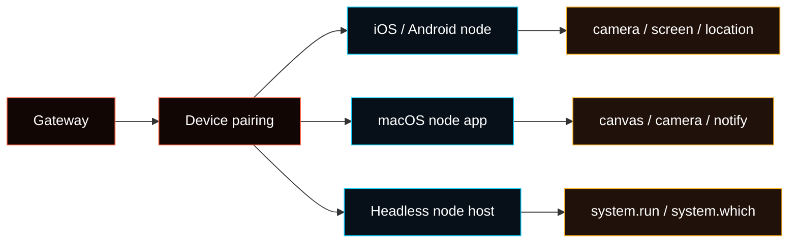

---
read_when:
  - 查看 Control UI 中的 Advanced > Nodes
  - 将 iOS、Android、macOS 或无头节点配对到 Gateway
  - 使用 canvas、camera、screen、location、notification 或 node-host exec
summary: 节点：配对设备、本地外设、节点主机执行、权限和诊断。
title: 节点
x-i18n:
  generated_at: "2026-05-31T00:00:00Z"
  model: manual
  provider: codex
  source_path: nodes/index.md
---

# 节点

**节点**是连接到 Gateway WebSocket 的配对设备或无头 runner，连接角色为
`role: "node"`，并通过 `node.invoke` 暴露设备或主机命令。

节点是可选外设。它们不运行 Gateway service，也不是首次 Agent 设置所必需的。
当你需要查看配对设备状态、待批准配对、能力、runtime client、权限或命令暴露细节时，使用 **Advanced > Nodes**。



协议细节见 [Gateway protocol](/gateway/protocol)。

## 什么在哪里管理

- **Advanced > Nodes**：节点状态、待配对、能力、权限、runtime client、原始诊断。
- **Agent > Tools**：选中的 Agent 是否允许使用 node-backed tools。
- **设备设置**：camera、screen、microphone、location、notification、wake-word 权限。
- **Advanced > Config**：只有没有专门页面时才编辑 raw config。

失败排查从 [Node troubleshooting](/nodes/troubleshooting) 开始。

## 配对和状态

WS 节点使用 device pairing。节点在 `connect` 时提交设备身份，Gateway 为
`node` 角色创建配对请求。

```bash
fased devices list
fased devices approve <requestId>
fased devices reject <requestId>
fased nodes status
fased nodes describe --node <idOrNameOrIp>
```

说明：

- 当 device pairing 包含 `node` 角色时，`nodes status` 会显示节点已配对。
- **Advanced > Nodes** 显示同一套 paired/runtime 状态。
- `node.pair.*` 和 `fased nodes pending/approve/reject` 是兼容旧客户端的路径。

## system.run 的节点主机

当 Gateway 在一台机器上运行，但 shell command 应在另一台机器上执行时，使用**节点主机**。模型仍然和 Gateway 通信；当选择 `host=node` 时，Gateway 把 `exec` 调用转发给节点主机。

运行位置：

- **Gateway host**：接收消息、运行模型、路由 tool call。
- **Node host**：执行 `system.run` 和 `system.which`。
- **Approvals**：在节点主机上通过 `~/.fased/exec-approvals.json` 执行。

启动节点主机：

```bash
export FASED_GATEWAY_TOKEN="<gateway-token>"
fased node run --host <gateway-host> --port 18789 --display-name "Build Node"
```

安装为 service：

```bash
fased node install --host <gateway-host> --port 18789 --display-name "Build Node"
fased node restart
```

托管 Gateway 建议使用 Tailscale 或私有 SSH tunnel。不要为了连接节点主机而公开原始 Gateway 端口。

SSH tunnel 示例：

```bash
# 终端 A：转发本地 18790 -> Gateway 127.0.0.1:18789
ssh -N -L 18790:127.0.0.1:18789 user@gateway-host

# 终端 B：节点通过 tunnel 连接
export FASED_GATEWAY_TOKEN="<gateway-token>"
fased node run --host 127.0.0.1 --port 18790 --display-name "Build Node"
```

在 Gateway host 上批准并命名：

```bash
fased devices list
fased devices approve <requestId>
fased nodes list
fased nodes rename --node <id|name|ip> --name "Build Node"
```

## Exec approvals 和绑定

Exec approvals 属于节点主机本地状态。

```bash
fased approvals get --node <id|name|ip>
fased approvals allowlist add --node <id|name|ip> "/usr/bin/uname"
```

设置 `exec host=node` 的默认节点：

```bash
fased config set tools.exec.host node
fased config set tools.exec.security allowlist
fased config set tools.exec.node "<id-or-name>"
```

按 session 设置：

```text
/exec host=node security=allowlist node=<id-or-name>
```

相关：

- [Node host CLI](/cli/node)
- [Exec tool](/tools/exec)
- [Exec approvals](/tools/exec-approvals)

## 常用节点命令

低层 invoke：

```bash
fased nodes invoke --node <idOrNameOrIp> --command canvas.eval --params '{"javaScript":"location.href"}'
```

高层 helper 在生成 Agent 附件时会打印 `MEDIA:<path>`。

| Capability        | CLI                                                                    |
| ----------------- | ---------------------------------------------------------------------- |
| Canvas snapshot   | `fased nodes canvas snapshot --node <id>`                              |
| Canvas navigation | `fased nodes canvas present --node <id> --target https://example.com`  |
| Canvas eval       | `fased nodes canvas eval --node <id> --js "document.title"`            |
| Camera photo      | `fased nodes camera snap --node <id>`                                  |
| Camera clip       | `fased nodes camera clip --node <id> --duration 10s`                   |
| Screen record     | `fased nodes screen record --node <id> --duration 10s --fps 10`        |
| Location          | `fased nodes location get --node <id>`                                 |
| System command    | `fased nodes run --node <id> -- echo "hello"`                          |
| Notification      | `fased nodes notify --node <id> --title "Ping" --body "Gateway ready"` |

## 能力说明

- `canvas.*`、`camera.*`、`screen.*` 通常要求 iOS/Android 节点 app 在前台。
- Camera 和 screen 命令需要 OS 权限。
- Location 默认关闭，并需要设备权限。
- Android `sms.send` 只在支持 telephony 且授予 SMS 权限的设备上可用。
- Screen 和 camera clip 有时长限制，以避免 payload 过大。
- `system.run` 受 macOS node mode 和无头 node host 上的 exec approvals 控制。

专题页面：

- [Camera capture](/nodes/camera)
- [Location command](/nodes/location-command)
- [Media understanding](/nodes/media-understanding)
- [Audio and voice notes](/nodes/audio)
- [Images and media](/nodes/images)
- [Talk mode](/nodes/talk)
- [Voice wake](/nodes/voicewake)

## 权限 map

节点可能在 `node.list` / `node.describe` 中包含 `permissions` map，按权限名键入，例如 `screenRecording` 或 `accessibility`，值为 boolean（`true` 表示已授予）。

## 无头节点主机

无头节点主机连接到 Gateway WebSocket，并暴露 `system.run` / `system.which`。它适合 Linux、Windows 或 Gateway 旁边的 server。

```bash
fased node run --host <gateway-host> --port 18789
```

说明：

- 仍然需要 pairing。
- 节点状态在 `~/.fased/node.json`。
- Exec approvals 在 `~/.fased/exec-approvals.json`。
- Gateway WebSocket 使用 TLS 时添加 `--tls` / `--tls-fingerprint`。
- 托管 Gateway 使用私有网络路径，不要公开 WebSocket。

## macOS node mode

macOS menubar app 可以作为 node 连接 Gateway，并暴露本地 canvas、camera、notification 和 exec-host 能力。Remote mode 下，优先使用 Tailscale 或 SSH tunnel 连接 loopback-bound Gateway。
