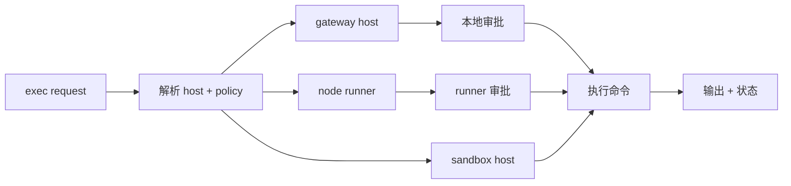

# Exec Host 重构

这是工程备注。面向 operator 的文档请看 [Exec tool](/tools/exec)、
[Exec approvals](/tools/exec-approvals)、[Elevated mode](/tools/elevated)、
[Nodes](/nodes) 和 [Gateway protocol](/gateway/protocol)。

## 状态

大部分已经成为当前 exec policy 路径。本文只保留设计边界和后续上下文。

## 目标

- 在 `sandbox`、`gateway`、`node` 三种 host 间路由执行。
- 跨 host 执行必须由显式配置和审批策略控制。
- 支持 per-Agent policy、allowlist、ask mode 和 node binding。
- node-host 执行通过 runner service。
- UI 审批提示可选；headless 模式也必须执行策略。

## Exec 路由

## 关键概念

| 概念         | 值                           | 含义                     |
| ------------ | ---------------------------- | ------------------------ |
| Host         | `sandbox`, `gateway`, `node` | 命令在哪里运行           |
| Security     | `deny`, `allowlist`, `full`  | host 如何 gate 执行      |
| Ask mode     | `off`, `on-miss`, `always`   | 何时请求审批 UI          |
| Node binding | node id/name/ip/prefix       | 哪个配对 node 可执行命令 |

解析顺序：

1. Tool 参数。
2. Agent override。
3. 全局 config。
4. 内置默认值。

## 默认行为

- `exec.host = sandbox`。
- 非 sandbox host 需要显式策略。
- 相关场景下 `exec.ask = on-miss`。
- 未设置 node binding 时，node 执行仍受 host policy 和 runner 审批约束。

## 配置表面

全局键：

- `tools.exec.host`
- `tools.exec.security`
- `tools.exec.ask`
- `tools.exec.node`

Per-Agent 键：

- `agents.list[].tools.exec.host`
- `agents.list[].tools.exec.security`
- `agents.list[].tools.exec.ask`
- `agents.list[].tools.exec.node`

快捷命令：

- `/elevated on`
- `/elevated ask`
- `/elevated full`
- `/elevated off`

## 审批存储

执行 host 使用本地审批状态，不是共享信任绕过。

要求：

- 存在本地 Fased state 目录。
- 文件权限 `0600`。
- Per-Agent policy 和 allowlist。
- headless 模式的 ask fallback。
- UI client 必须认证后才能提交审批结果。

## Runner 和 UI

Node-host 执行通过配对 node runner。当审批 UI 可用时，runner 可通过本地 IPC
请求确认。UI 不可用时，runner 使用配置的 fallback。

## 事件

Exec 生命周期事件保持简短：

- `Exec started`
- `Exec finished`
- `Exec denied`

事件按 session 作用域记录，避免向执行上下文外泄露不必要命令细节。

## 测试

- Allowlist 匹配。
- Policy 解析优先级。
- Gateway host deny/allow/ask flow。
- Node runner deny/allow/ask flow。
- Gateway event 映射。
