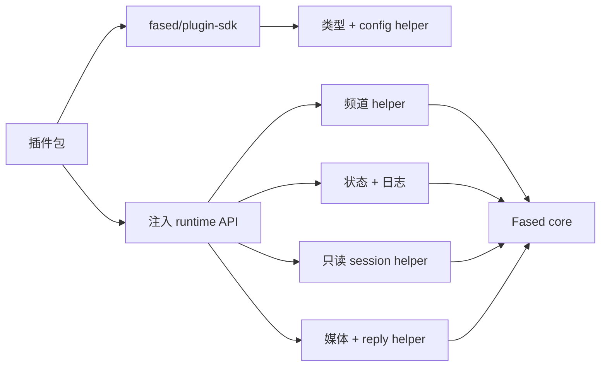

# 插件 SDK 重构

这是工程备注，不是稳定的公开插件 API 参考。公开文档请看
[Plugin manifest](/plugins/manifest)、[Plugin agent tools](/plugins/agent-tools)
和 [Tools](/tools)。

## 状态

Fased 已经有核心插件 SDK/runtime 表面。内置插件和外部插件应依赖 Fased
SDK 与注入的 runtime API。插件代码直接导入 `src/**` 属于迁移债务。

迁移期间可以保留兼容别名，但新文档和新插件代码只应使用 Fased 导入路径。

## 目标边界

## SDK 范围

SDK 只放编译期内容：类型、manifest helper、config helper、action gate helper、
频道元数据 helper、docs link helper。它不应接触 runtime 状态，也不应导入
Fased 内部实现。

## Runtime 范围

Runtime 通过 `FasedAgentPluginApi.runtime` 注入。插件使用 runtime helper，
而不是导入内部源码。

| Runtime 组         | 用途                              |
| ------------------ | --------------------------------- |
| `channel.text`     | 分块、命令检测、文本限制          |
| `channel.reply`    | reply 派发与缓冲发送              |
| `channel.routing`  | channel/account/peer session 路由 |
| `channel.pairing`  | pairing 回复与 allow-from 读取    |
| `channel.media`    | 远程媒体抓取和保存                |
| `channel.mentions` | mention 正则和匹配                |
| `channel.groups`   | group policy 和 require-mention   |
| `channel.debounce` | inbound debounce                  |
| `channel.commands` | command 授权 helper               |
| `logging`          | 插件日志                          |
| `state`            | 状态目录解析                      |
| `helpers.sessions` | 只读 session 状态/元数据          |

## Session Helper 规则

`runtime.helpers.sessions` 只能读取经过清理的 session 状态。它不暴露 transcript、
消息正文、原始文件路径、钱包动作、节点调用、配置修改、插件安装或 Gateway
dispatcher。

## 迁移计划

1. 保持 SDK/runtime 导出稳定。
2. 用注入 runtime helper 替换扩展里的 bridge。
3. 先迁移轻量直接导入插件。
4. 在 reply/routing helper 完成后迁移更复杂的频道插件。
5. 加 CI 检查，避免插件包导入 `src/**`。

## 兼容性

- SDK 按 semver 变更。
- Runtime 随 Fased core release 版本化。
- 插件声明所需 runtime 版本范围。
- 兼容别名只是迁移支持，不是公开文档表面。

## 成功标准

- 内置 connector 使用 SDK + 注入 runtime。
- 新 connector 模板只依赖 SDK/runtime。
- 外部插件无需核心源码导入即可开发。
- 重构备注与用户安装/设置文档保持分离。
