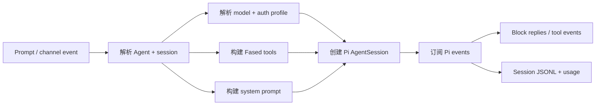
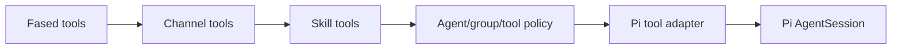

# Pi 集成架构

Fased 直接嵌入 Pi agent runtime，而不是启动单独的 `pi` 进程。这是维护者
参考页；普通 operator 设置请看 [Getting Started](/start/getting-started)、
[Models](/providers/index) 和 [Agent Runtime](/concepts/agent)。

## 依赖边界

Fased 从 `package.json` 使用这些 Pi package：

- `@mariozechner/pi-ai`
- `@mariozechner/pi-agent-core`
- `@mariozechner/pi-coding-agent`
- `@mariozechner/pi-tui`

具体版本以 `package.json` 和 lockfile 为准，不在本文复制。

## Runtime 路径

## Source Map

| 区域               | 主要文件                                                                                            |
| ------------------ | --------------------------------------------------------------------------------------------------- |
| Runner entry       | `src/agents/pi-embedded-runner.ts`, `src/agents/pi-embedded-runner/run.ts`                          |
| Run attempt        | `src/agents/pi-embedded-runner/run/attempt.ts`                                                      |
| Session manager    | `src/agents/pi-embedded-runner/session-manager-*`                                                   |
| Event subscription | `src/agents/pi-embedded-subscribe*.ts`                                                              |
| Tool creation      | `src/agents/pi-tools*.ts`, `src/agents/tools/**`                                                    |
| Tool adapter       | `src/agents/pi-tool-definition-adapter.ts`                                                          |
| Model/auth         | `src/agents/pi-embedded-runner/model.ts`, `src/agents/model-auth.ts`, `src/agents/auth-profiles/**` |
| System prompt      | `src/agents/pi-embedded-runner/system-prompt.ts`, `src/agents/system-prompt*.ts`                    |
| Compaction/pruning | `src/agents/pi-embedded-runner/compact.ts`, `src/agents/pi-extensions/**`                           |
| Provider quirks    | `src/agents/pi-embedded-runner/extra-params.ts` 和 provider wrapper                                 |

## Session 生命周期

1. 解析 Agent、channel/session key、workspace、model role、auth profile 和 tool policy。
2. 通过 Pi session manager 打开或创建 session JSONL。
3. 用 Fased tools 和 Fased system prompt 创建 Pi `AgentSession`。
4. 订阅 assistant text、tool call、compaction、error 和 lifecycle event。
5. 将 response blocks 流回 Chat、Tasks 或 channel delivery。
6. 通过 Fased store 记录 session state 和 usage metadata。

## Tool Pipeline

Fased 不直接暴露 Pi 默认 tool surface。它构建受控 tool list，适配为 Pi tool
definition，再应用 policy。

规则：

- Tool availability 由 Agent、channel、group、sandbox 和 wallet policy 控制。
- Channel tools 只在当前 route 支持时注入。
- Wallet-capable skill 仍需要单独 wallet grant。
- Tool result 在进入 provider adapter 前会规范化。

## Model 和 Auth

- Model ref 使用 `provider/model`。
- Auth profile 可按配置在失败时轮换。
- Failover 使用 Fased fallback policy，不是 provider 保证。
- Provider-specific request shaping 留在 embedded runner/provider 模块。

## Compaction 和 History

Fased 保留 Pi session JSONL persistence，同时增加：

- context overflow 处理
- 手动/自动 compaction
- cache-aware pruning
- image prompt handling
- token/usage history
- session archive 和 memory hook

更多细节见 [Session Management & Compaction](/reference/session-management-compaction)、
[Prompt caching](/reference/prompt-caching) 和 [Memory Config](/reference/memory-config)。

## Streaming 和 Replies

Pi emits assistant、tool 和 lifecycle events。Fased 将它们转成 Chat stream、
channel block replies、tool summaries、task run updates 和 usage records。

## 测试

主要覆盖：

- `src/agents/pi-embedded-*.test.ts`
- `src/agents/pi-embedded-runner/**/*.test.ts`
- `src/agents/pi-embedded-subscribe*.test.ts`
- `src/agents/pi-tools*.test.ts`
- `src/agents/pi-tool-definition-adapter*.test.ts`
- `src/agents/pi-extensions/**/*.test.ts`

需要真实 provider credential 的 live 测试使用 `FASED_LIVE_TEST=1`。

运行命令见 [Pi Development Workflow](/reference/pi-development) 和
[Tests](/reference/test)。
