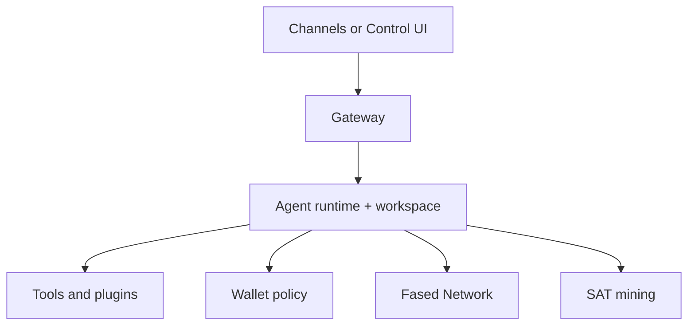

---
read_when:
  - 新手引导新的 Agent 实例时
  - 审查安全/权限影响时
  - 从首次聊天进入真实操作员设置时
summary: 将 Fased 作为带渠道、钱包、Fased Network 和 SAT 路径的主权个人 Agent 运行
title: 个人 Agent 设置
x-i18n:
  generated_at: "2026-02-03T07:54:35Z"
  model: claude-opus-4-5
  provider: pi
  source_hash: 2763668c053abe34ea72c40d1306d3d1143099c58b1e3ef91c2e5a20cb2769e0
  source_path: start/fased.md
  workflow: 15
---

# 使用 Fased 构建主权个人 Agent

Fased 不只是消息网关。它是一个可自托管的个人 Agent 运行时，可以运行在你的机器或 VPS 上，然后按需扩展渠道、钱包、Fased Network 和 SAT mining。

这篇指南是从“能启动”走到“像我的 Agent 一样工作”的实用路径。

## ⚠️ 安全第一

你正在让 Agent 可能具备以下能力：

- 在你的机器上运行命令（取决于工具设置）
- 在工作区读写文件
- 通过你连接的渠道向外发送消息
- 如果你启用相关功能，后续还可能控制钱包或参与网络流程

从保守设置开始：

- 默认保持 Gateway 私有。
- 对消息渠道使用 allowlist 或 pairing。
- 先只连接一个可信渠道和一个可信用户。
- 心跳默认每 30 分钟运行一次。在你信任设置前，可以设置 `agents.defaults.heartbeat.every: "0m"` 禁用。
- 在基础运行时稳定前，不要启用带钱包或公共网络暴露的流程。

## 前提条件

- 已安装并完成 Fased onboarding；如果还没有，请先看[入门指南](/start/getting-started)
- **Agent > Models** 中有可用模型/认证路径
- 如果你想要干净的助手身份，可选准备专用渠道账号或第二个手机号

## 清晰的 mental model

把产品看成几层：



最安全的扩展顺序是：

1. 先让运行时稳定
2. 连接一个可信渠道
3. 调整工作区和身份
4. 只有需要时再添加钱包、Fased Network 或 mining

## 5 分钟快速开始

1. 完成 onboarding 并安装 daemon：

```bash
fased onboard --install-daemon
```

2. 打开 Dashboard 并确认 Gateway：

```bash
fased dashboard
fased status
```

3. 在 Control UI 里完成这个 Agent：

- **Agent > Models**：添加模型 API key 或登录，然后选择这个 Agent 的模型引用。
- **Agent > Skills**：创建、审核、安装、配置、编辑并允许技能。
- **Agent > Channels**：只有需要浏览器外聊天时再连接第一个 app。
- **Agent > Services**：连接 web/search、Gmail、Calendar、GitHub、browser/media 或自定义 API。
- **Agent > Memory** 和 **Agent > Tasks**：只有需要时再启用 session archives 和定时任务。

页面级设置地图见 [Control UI 设置模型](/start/control-ui-setup)。

如果使用消息渠道，请保持访问受限。

onboarding 完成后，Fased 会打开或打印 dashboard URL。如果出现认证提示，使用 `gateway.auth.token` 中的 token。

## 运行时 profile：local vs hosting

Fased onboarding 现在有两个真实操作员 profile：

- `local`
- `hosting`

使用 `local` 的情况：

- 这是你的个人运行时机器
- 浏览器 Dashboard 是主要控制面
- tailnet 暴露是可选项

使用 `hosting` 的情况：

- 这是 VPS 或 always-on 节点
- 你想使用 managed runtime 路径
- 你需要 Fased Network hosted routing 和持久服务行为

关键细节：

- `hosting` 使用 managed runtime 启动
- local onboarding 通常保持普通 gateway 启动
- 如果 local onboarding 中启用了 Fased Network，Fased 也会持久化 managed mode，确保 hosted public routing 在重启后继续保持

所以 profile 选择不只是安全默认值。

## SAT runtime ids

预发布版本不会内置可用的 SAT mainnet ids。官方 mainnet proof 发布后，
请在 Mining 页面点击 **Sync**，验证已签名 manifest 后再写入本地文件：

- `config/sat-runtime.env`

手动填写只适用于恢复、审查，或明确的 local/devnet 测试。Mainnet 用户应以
官方 docs 和签名 manifest 为准。

## 给 Agent 一个真实工作区

Fased 从工作区目录读取操作指令、记忆和身份。

默认情况下，Fased 使用 `~/.fased/workspace` 作为 Agent 工作区，并会在 setup/首次 Agent 运行时自动创建它，以及起始的 `AGENTS.md`、`SOUL.md`、`TOOLS.md`、`IDENTITY.md`、`USER.md`、`HEARTBEAT.md`。`BOOTSTRAP.md` 只在工作区全新时创建；删除后不应自动回来。`MEMORY.md` 是可选文件；存在时会被普通会话加载。Subagent 会话只注入 `AGENTS.md` 和 `TOOLS.md`。

把这个文件夹当成 Agent 的操作记忆。可以的话，把它放进私有 git repo。

```bash
fased setup
```

完整工作区布局和备份指南：[Agent workspace](/concepts/agent-workspace)
记忆工作流：[Memory](/concepts/memory)

可选：用 `agents.defaults.workspace` 选择其他工作区（支持 `~`）。

```json5
{
  agent: {
    workspace: "~/.fased/workspace",
  },
}
```

如果你已经从自己的 repo 提供工作区文件，可以完全禁用 bootstrap 文件创建：

```json5
{
  agent: {
    skipBootstrap: true,
  },
}
```

## 会话和记忆

- 会话文件：`~/.fased/agents/<agentId>/sessions/{{SessionId}}.jsonl`
- 会话元数据（token 使用量、最后路由等）：`~/.fased/agents/<agentId>/sessions/sessions.json`（旧路径：`~/.fased/sessions/sessions.json`）
- `/new` 或 `/reset` 为该聊天启动新会话（可通过 `resetTriggers` 配置）。如果单独发送，Agent 会回复简短问候确认重置。
- `/compact [instructions]` 压缩会话上下文并报告剩余上下文预算。

## 心跳（主动模式）

默认情况下，Fased 每 30 分钟运行一次心跳，提示词为：
`Read HEARTBEAT.md if it exists (workspace context). Follow it strictly. Do not infer or repeat old tasks from prior chats. If nothing needs attention, reply HEARTBEAT_OK.`
设置 `agents.defaults.heartbeat.every: "0m"` 可禁用。

- 如果 `HEARTBEAT.md` 存在但实际为空（只有空行和 markdown 标题），Fased 会跳过心跳运行以节省 API 调用。
- 如果文件不存在，心跳仍会运行，由模型决定是否需要行动。
- 如果 Agent 回复 `HEARTBEAT_OK`，Fased 会抑制该心跳的出站投递。
- 心跳运行完整 Agent turn；更短间隔会消耗更多 token。

## 什么时候添加钱包、Fased Network 或 SAT

不要把这些当作第一天的必需项。

建议顺序：

1. 基础运行时可信后再配置 wallet policy
2. 主机和远程访问稳定后再启用 Fased Network
3. 钱包选择、funding 和操作员意图明确后再启用 SAT mining

相关文档：

- [Operator glossary](/start/operator-glossary)
- [Wallet](/plugins/crypto/wallet-page)
- [Fased Network guide](/start/federation)
- [Mining](/plugins/crypto/mining-page)
- [Advanced SAT mining](/plugins/crypto/mining-advanced)
- [Remote access](/gateway/remote)

## 自托管钱包路径

公开 Fased 文档现在把自托管钱包路径视为 canonical。

期望的生产形态：

- 自托管钱包材料
- `local-socket-signer`
- 每个角色都有明确 wallet id
- automation 前强制执行 runtime policy

实用角色拆分：

- 普通发送使用 primary wallet
- SAT 只使用 mining wallet
- 之后的 payments 或 treasury 使用单独 wallet

除非你接受更大的影响范围，否则不要一个钱包做所有事情。

## 运维检查

```bash
fased status
fased status --all
fased status --deep
fased health --json
```

日志默认位于 `/tmp/fased/`，也可以在 Control UI 的 **Logs** 查看。高级诊断在 **Advanced > Debug** 和 **Advanced > Nodes**。

## 下一步

- Chat/WebChat：[Chat 和 WebChat](/web/webchat)
- Control UI：[Control UI](/web/control-ui)
- Gateway 运维：[Gateway runbook](/gateway)
- 定时任务：[Tasks / cron jobs](/automation/cron-jobs)
- Wallet：[Wallet](/plugins/crypto/wallet-page)
- Mining：[Mining](/plugins/crypto/mining-page)
- Fased Network：[Fased Network](/start/federation)
- Remote access：[Remote access](/gateway/remote)
- Security：[Security](/security)
